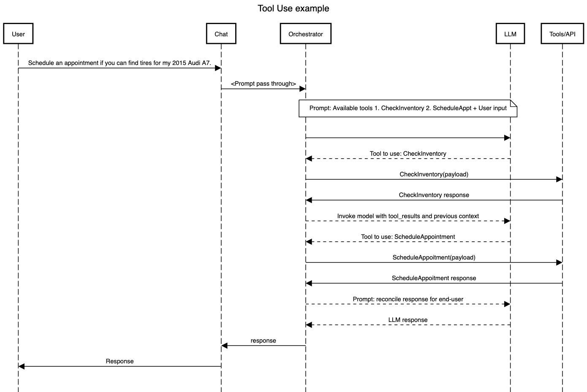

# Tool use (function calling) with AWS Step Functions

This sample app is pretty simple yet showcases one of the most powerful nature of generative AI. 
In order to understand Tool use you need to understand [ReAct prompting](https://www.promptingguide.ai/techniques/react) framework. 
The ReAct framework allows LLMs to interact with external tools to retrieve additional information that leads to relatively more reliable and factual responses.
In ReAct, the onus is on an LLM agent to orchestrate invocation of tools that are supplied to an agent. The agent relies on output token to make a decision on invoking a tool.
However, as soon as the context window and token size increases, the agent's accuracy tend to decrease proportionally, and the token limits are reached.

There is where tool use or function calling comes to rescue. While invoking a model, extra attributes are provided to the LLM to make it cognizant of the tools that are available at its disposal. However, in this case there is no agent that orchestrates the tool. It is left to the user to orchestrate based on the tool that LLM suggests should be used. This concept looks simple yet very powerful when you see it in action.

AWS Step Functions workflow orchestrates the use of tools as soon as it finds out which tool was suggested by the LLM to use. 
You will understand this better with an example.

## Car repair shop example

### Sequence diagram


## Deploy the sample application

To deploy this application, you need the following tools. You will also need access to Claude Haiku model in Bedrock. 
You can follow [this model access user guide](https://docs.aws.amazon.com/bedrock/latest/userguide/model-access.html) to gain access.

* SAM CLI - [Install the SAM CLI](https://docs.aws.amazon.com/serverless-application-model/latest/developerguide/serverless-sam-cli-install.html)
* Node.js - [Install Node.js 20](https://nodejs.org/en/), including the NPM package management tool.

To build and deploy your application for the first time, run the following in your shell:

```bash
sam build && sam deploy --guided
```

Provide these information when asked:

```bash
Setting default arguments for 'sam deploy'
  =========================================
  Stack Name [sam-app]: tool-use-with-stepfunctions 
  AWS Region [us-east-1]: us-east-1
  #Shows you resources changes to be deployed and require a 'Y' to initiate deploy
  Confirm changes before deploy [Y/n]: y
  #SAM needs permission to be able to create roles to connect to the resources in your template
  Allow SAM CLI IAM role creation [Y/n]: y
  #Preserves the state of previously provisioned resources when an operation fails
  Disable rollback [y/N]: 
  Save arguments to configuration file [Y/n]: y
  SAM configuration file [samconfig.toml]: 
  SAM configuration environment [default]:
```

You can find your State Machine ARN in the output values displayed after deployment.

## Testing this app from Step Functions console
Execute the Step Functions by providing this input payload:

```json
{
  "messages": [
    {
      "role": "user",
      "content": "Schedule an appointment if you can find tires for my 2015 Audi A7."
    }
  ]
}
```

Check state machine response in the last success step.

## Cleanup

To delete the sample application that you created, use the AWS CLI. Assuming you used your project name for the stack name, you can run the following:

```bash
sam delete --stack-name tool-use-with-stepfunctions
```